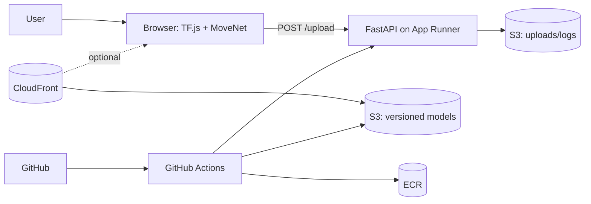

# Deploy (CI/CD-first)

## 0) Architecture decisions (why this is simple and works)

* **Inference in browser (TF.js + MoveNet)** → zero GPU/ML infra to manage.
* **FastAPI on AWS App Runner** → one container, auto HTTPS, scales itself.
* **S3 (uploads) + optional S3+CloudFront (models)** → cheap storage, easy CDN.
* **GitHub Actions** → one pipeline that can **create infra** and **deploy app**.

<details>
<summary>Micro diagram</summary>



</details>

---

## 1) Fork & set repo secrets (once)

Go to **Settings → Secrets and variables → Actions → New repository secret** and add:

* `AWS_ACCESS_KEY_ID`
* `AWS_SECRET_ACCESS_KEY`
* `AWS_ACCOUNT_ID`
* `AWS_REGION` (e.g., `ap-south-1`)
* *(Optional, only if you sync models from Kaggle)* `KAGGLE_USERNAME`, `KAGGLE_KEY`

> The screenshot in this repo shows exactly these entries. Least-privilege IAM is recommended (ECR, CloudFormation, App Runner, S3).

---

## 2) Run **infra-setup.yml** (creates AWS resources)

From the repo’s **Actions** tab:

1. Select **“Infra: setup base stacks”** (file: `.github/workflows/infra-setup.yml`).
2. Click **Run workflow** (accept defaults like `Environment=prod` unless you need `dev`).

This workflow will:

* Create **ECR** repo
* Create **App Runner** service + IAM roles
* Create **S3 (uploads)**
* *(Optional)* Create **S3 (models)** + **CloudFront** with OAI

**Outputs** appear in the job summary (save these):

* `APP_RUNNER_URL` (e.g., `https://xxxx.ap-south-1.awsapprunner.com`)
* `UPLOADS_BUCKET`
* *(Optional)* `CLOUDFRONT_DOMAIN`

---

## 3) Point the frontend to the backend

Edit `frontend/main.js`:

```js
// Required: your App Runner URL from step 2
const BACKEND_UPLOAD_URL = "https://<your-app-runner>.awsapprunner.com/upload";

// Simple path: use TensorFlow-hosted MoveNet
const USE_CUSTOM_MODEL_CDN = false;

// (Optional) If you enabled CloudFront models:
const CLOUDFRONT_BASE_URL = "https://<your-cloudfront-domain>/models";
```

Commit & push.

---

## 4) Deploy the backend (CI/CD)

Push to `main` (or open the **Actions** tab and run **“Backend CI/CD (App Runner via ECR)”** — file: `.github/workflows/backend-deploy.yml`).

The pipeline does:

1. **Login to ECR**
2. **Build** Docker image for FastAPI
3. **Push** to ECR
4. **Deploy/Update** the **App Runner** service
5. *(Optional)* **Sync TF.js models** to S3 (uses `KAGGLE_*` if enabled)

When it finishes, the backend is live at your **`APP_RUNNER_URL`**.

---

## 5) CORS & quick test

* In App Runner **env vars** (set by CloudFormation or update via console), make sure

  ```
  ALLOWED_ORIGINS = http://localhost:8080,https://<your-frontend-domain>
  S3_UPLOAD_BUCKET = <value from step 2>
  APP_ENV = prod
  ```
* Check health: `GET https://<your-app-runner>/health` → `{"status":"ok"}`.
* Run a local static server for the frontend:

  ```bash
  cd frontend && python -m http.server 8080
  # open http://localhost:8080 and try a video/image
  ```

If you see a CORS error in the browser console, add the exact origin (scheme + host + port) to `ALLOWED_ORIGINS` and redeploy.

---

## 6) Optional: host models via CloudFront

If you want versioned models under your control:

1. Ensure **model S3 + CloudFront** was created by `infra-setup.yml`.
2. Run the **model sync** job (included in `backend-deploy.yml` or as a separate workflow).
3. Switch the frontend:

   ```js
   const USE_CUSTOM_MODEL_CDN = true;
   const CLOUDFRONT_BASE_URL = "https://<your-cloudfront-domain>/models";
   ```
4. If 403 from CloudFront, check the **OAI bucket policy** and **invalidate** cache.

---

## What the reviewer can do quickly

* Fork → add the 4 AWS secrets → run **infra-setup.yml** → edit `frontend/main.js` with the App Runner URL → push → watch **backend-deploy.yml** go green → open the frontend and see keypoints; S3 gets JSON uploads.

That’s it. If you want, send me your **App Runner URL** and **(optional) CloudFront domain**, and I’ll drop them into the README before you submit.
